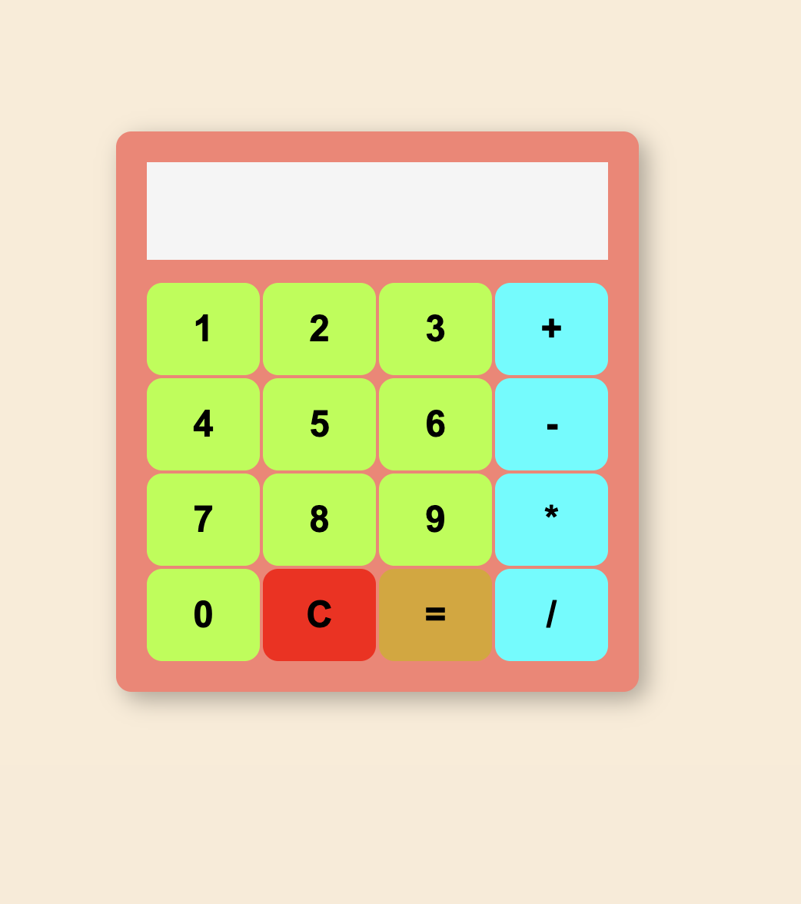

# 🧮 JavaScript Hesap Makinesi

Bu proje, HTML, CSS ve Vanilla JavaScript kullanılarak sıfırdan geliştirilmiş, tam fonksiyonlu bir web hesap makinesidir. CSS Grid kullanılarak modern ve profesyonel bir tuş takımı tasarımı oluşturulmuştur.

## 🚀 Özellikler

* Dört işlem (Toplama, Çıkarma, Çarpma, Bölme) yapabilme yeteneği.
* **CSS Grid** ile kusursuz hizalanmış, responsive (esnek) tuş takımı.
* Dinamik ekran güncellemesi ve anlık hesaplama.
* `C` (Clear) butonu ile ekranı ve hafızayı anında sıfırlama özelliği.
* Renkli ve modern arayüz tasarımı.

## 📸 Ekran Görüntüsü

## 🛠️ Kullanılan Teknolojiler

* **HTML5** (Semantik yapı)
* **CSS3** (Flexbox, CSS Grid Sistemi, Hover/Active animasyonları)
* **JavaScript** (DOM Manipülasyonu, Event Listeners, `eval()` fonksiyonu veya matematiksel algoritmalar)