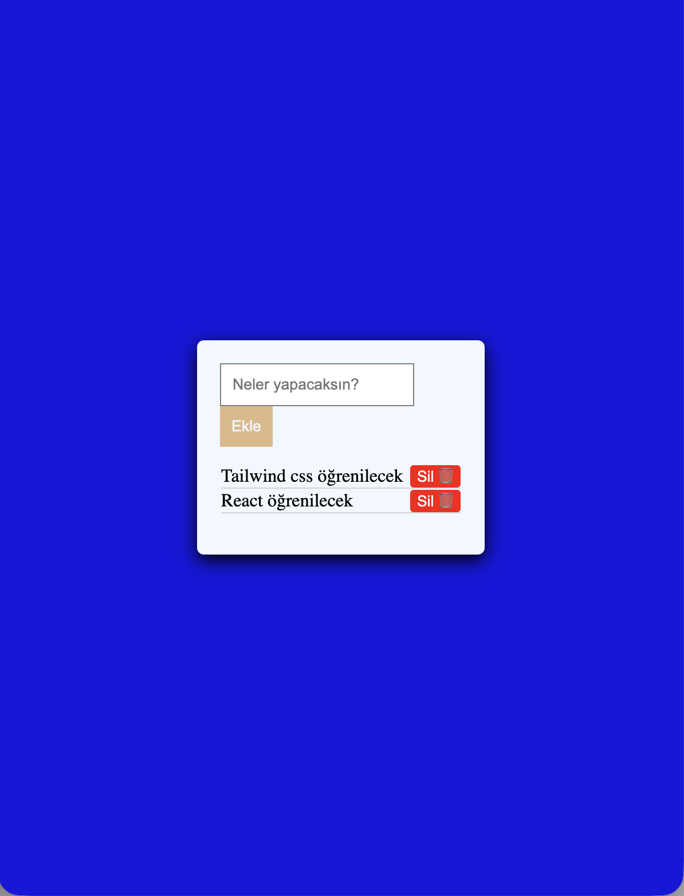

# 📝 JavaScript To-Do List (Görev Yöneticisi)

Bu proje, HTML, CSS ve Vanilla JavaScript kullanılarak sıfırdan geliştirilmiş bir Görev Yöneticisi uygulamasıdır. Kullanıcıların eklediği görevler tarayıcının yerel hafızasına (LocalStorage) kaydedilir, böylece sayfa yenilendiğinde veriler kaybolmaz.

## 🚀 Özellikler

* Kullanıcı dostu arayüz ile hızlı görev ekleme.
* Eklenen görevleri tek tıkla silebilme.
* **LocalStorage Entegrasyonu:** Veriler tarayıcı hafızasında tutulur (Kalıcı veri).
* CSS Flexbox ile ortalanmış, esnek tasarım.

## 📸 Ekran Görüntüsü

## 🛠️ Kullanılan Teknolojiler

* **HTML5** (Semantik yapı)
* **CSS3** (Flexbox, UI/UX tasarımı)
* **JavaScript** (DOM Manipülasyonu, Event Listeners, JSON Parse/Stringify)