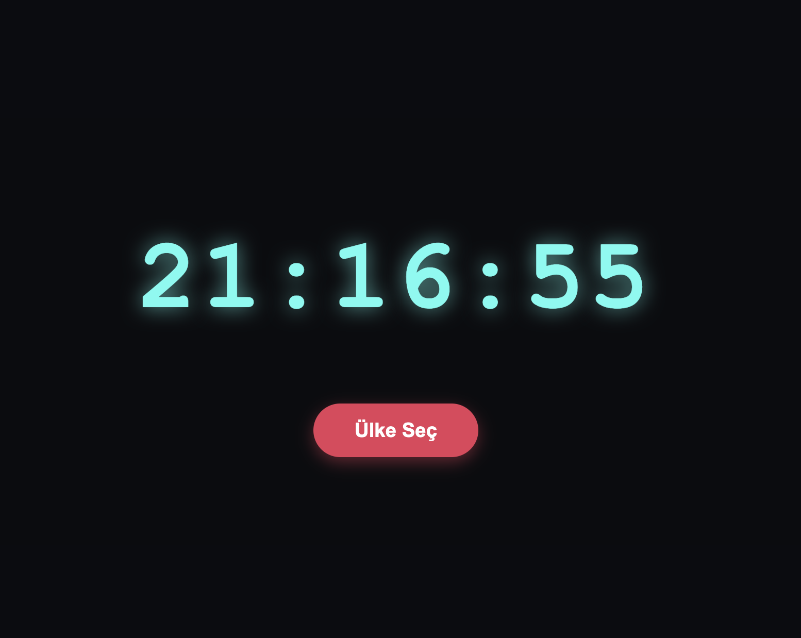

# 🌍 Dünya Saati (World Clock) & npm Entegrasyonu

Bu proje, Vanilla JavaScript ile **npm (Node Package Manager)** ekosistemini birleştirerek geliştirilmiş canlı bir dünya saati uygulamasıdır. Projede dışarıdan harici kütüphaneler (external packages) projeye dahil edilmiş ve Frontend tarafında başarıyla kullanılmıştır.

## 🚀 Özellikler

* Saniyede bir güncellenen, "Day.js" destekli canlı dijital saat.
* **Zaman Yolculuğu:** Kullanıcının menüden seçtiği ülkeye (örn: Tokyo, New York) göre saati anında o ülkenin yerel saatine dönüştürme.
* Harici bir CSS kütüphanesi olan **Micromodal.js** kullanılarak sıfırdan farksız, pürüzsüz açılır pencere (modal) deneyimi.
* Cyberpunk/Neon temalı, flexbox mimarisine sahip modern UI tasarımı.

## 📸 Ekran Görüntüsü

## 🛠️ Kullanılan Teknolojiler ve Paketler

* **HTML5 & CSS3** (Flexbox, Text-Shadow Neon Efektleri)
* **Vanilla JavaScript** (DOM Manipülasyonu, `setInterval` ile zaman döngüsü)
* **[Day.js](https://day.js.org/)** (Zaman/Tarih yönetimi ve formatlama)
* **Day.js Plugins:** `utc` ve `timezone` eklentileri ile performanslı saat dilimi dönüşümleri.
* **[Micromodal.js](https://micromodal.vercel.app/)** (Hafif ve erişilebilir modal yönetimi)
* **npm** (Paket bağımlılıklarının `package.json` ile yönetilmesi)