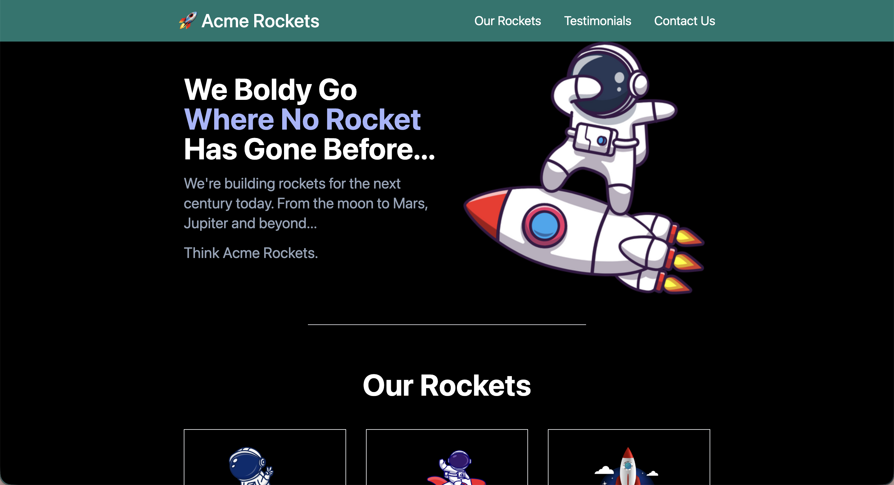

# 🚀 Acme Rockets - Tailwind CSS Landing Page

Bu proje, Tailwind CSS öğrenme serüvenimde geliştirdiğim, tamamen duyarlı (responsive) ve karanlık mod (dark mode) destekli bir modern web sitesi açılış sayfasıdır (landing page). 

## 🌟 Proje Özellikleri ve Öğrenilen Kavramlar

- **Mobile-First (Önce Mobil) Tasarım:** Tailwind'in `sm:` (small screens) breakpoint'leri kullanılarak mobil cihazlardan masaüstü ekranlara kusursuz geçiş sağlandı. (Örn: Mobilde hamburger menü, masaüstünde yatay navigasyon).
- **Karanlık Mod (Dark Mode):** İşletim sisteminin veya tarayıcının temasına göre otomatik değişen renk paleti eklendi (`dark:bg-black`, `dark:text-white`).
- **Flexbox Layout:** Sayfa iskeleti, navigasyon barı ve roket kartları `flex` yapısı ile hizalandı ve boşluklandırıldı.
- **Modern UI Bileşenleri:** Gölgelendirmeler (`shadow-xl`), yuvarlak köşeler (`rounded-3xl`) ve şeffaflık efektleri (`hover:opacity-90`) ile modern bir arayüz tasarlandı.
- **Smooth Scrolling (Akıcı Kaydırma):** Sayfa içi link (anchor) yönlendirmelerinde yumuşak geçişler ve üstte yapışkan kalan menünün (sticky header) başlıkları kapatmaması için `scroll-mt` (scroll margin top) ayarları uygulandı.

## 📸 Proje Görseli

## 🛠️ Kullanılan Teknolojiler

- HTML5
- Tailwind CSS (v3 - JIT Compiler)
- NPM (Node Package Manager)

## 🚀 Nasıl Çalıştırılır?

1. Projeyi bilgisayarınıza indirin veya klonlayın.
2. Gerekli bağımlılıkları kurmak için terminalde `npm install` komutunu çalıştırın.
3. Tailwind derleyicisini başlatmak için: `npm run tailwind`
4. `build/index.html` dosyasını VS Code Live Server ile açarak tarayıcıda görüntüleyin.