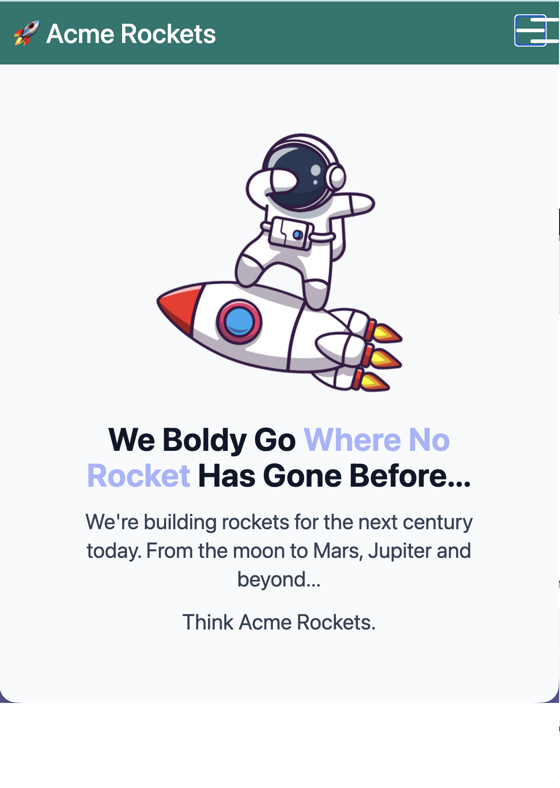
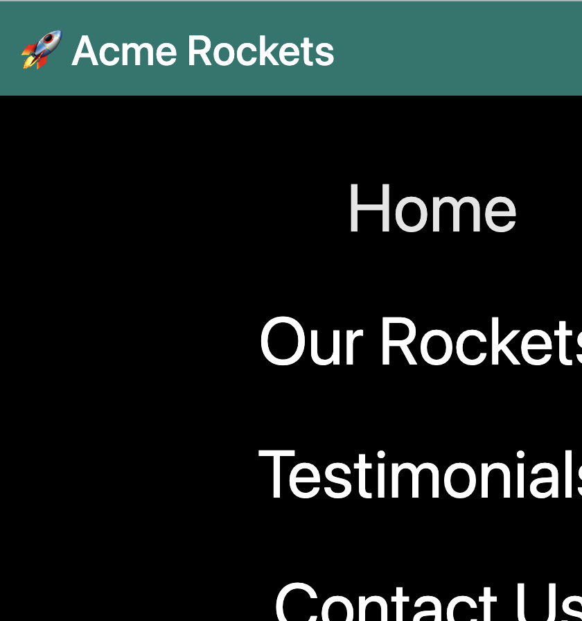

# 🚀 Acme Rockets - Tailwind CSS Landing Page

Bu proje, modern web teknolojilerini kullanarak geliştirilmiş, tamamen duyarlı (responsive) ve karanlık mod (dark mode) destekli bir "landing page" çalışmasıdır.

## 🌟 Öne Çıkan Özellikler

- **Modern Tasarım:** Tailwind CSS v3 kullanılarak oluşturulmuş estetik ve işlevsel arayüz.
- **Karanlık Mod Desteği:** Kullanıcının sistem tercihine göre otomatik uyum sağlayan koyu tema desteği.
- **Duyarlı (Responsive) Yapı:** Mobil cihazlardan geniş ekranlara kadar kusursuz görünüm.
- **İnteraktif Mobil Menü:** JavaScript ile kontrol edilen, tıklanınca "X" işaretine dönüşen hamburger menü animasyonu.
- **Özel Animasyonlar:** CSS keyframe'leri ile desteklenen "open-menu" animasyonu.
- **Erişilebilirlik:** Semantik HTML etiketleri ve ARIA etiketleri ile optimize edilmiş yapı.

## 🛠️ Kullanılan Teknolojiler

- **HTML5:** Sayfa yapısı ve içeriği.
- **Tailwind CSS v3:** Yardımcı sınıf tabanlı (utility-first) stil yönetimi.
- **JavaScript (Vanilla):** Menü etkileşimi ve DOM yönetimi.
- **NPM:** Paket yönetimi ve derleme süreçleri.

## 📸 Ekran Görüntüsü




## 📁 Proje Yapısı

- `build/index.html`: Ana sayfa içeriği.
- `build/js/main.js`: Mobil menü ve buton animasyon mantığı.
- `src/input.css`: Özel Tailwind katmanları ve animasyon tanımları.
- `build/css/style.css`: Derlenmiş (production-ready) CSS dosyası.
- `build/img/`: Vektörel roket görselleri ve medya dosyaları.

## 🚀 Başlangıç ve Kurulum

Projeyi yerel ortamınızda çalıştırmak için:

1. **Bağımlılıkları Yükleyin:**
   ```bash
   npm install